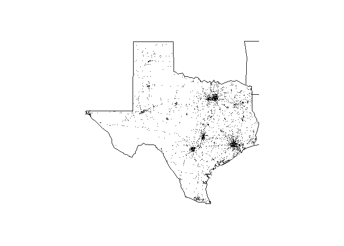

<!-- README.md is generated from README.Rmd. Please edit that file -->
fars (Fatality Accident Reorting System)
========================================

[](https://travis-ci.org/john-s-christensen/fars)

There are two things you can do with the fars package:

1.  You can summarize car accident fatality counts by year & month using the `fars_summarize_years()` function
2.  You can visualize car accident fatalities within a state & year using the `fars_map_state()` function

Installation
------------

You can install fars from github with:

``` r
# install.packages("devtools")
devtools::install_github("john-s-christensen/fars")
```

Example
-------

Here is a basic example:

``` r
library(fars)
fars_summarize_years(c(2013, 2014, 2015))
#> # A tibble: 12 x 4
#>    MONTH `2013` `2014` `2015`
#>    <int>  <int>  <int>  <int>
#>  1     1   2230   2168   2368
#>  2     2   1952   1893   1968
#>  3     3   2356   2245   2385
#>  4     4   2300   2308   2430
#>  5     5   2532   2596   2847
#>  6     6   2692   2583   2765
#>  7     7   2660   2696   2998
#>  8     8   2899   2800   3016
#>  9     9   2741   2618   2865
#> 10    10   2768   2831   3019
#> 11    11   2615   2714   2724
#> 12    12   2457   2604   2781

fars_map_state(48, 2015)
```


